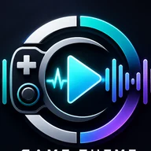

  

<h1 align="center">Game Theme Music</h1>

  Give Steam and non-Steam games their own soundtrack on Steam Deck.

  <strong>Current public tester: 3.6.9</strong>

## Download

**[Download Game Theme Music 3.6.9](https://github.com/ValentineBSAA/Game-Theme-Music-/releases/download/V3.6.9/Game-Theme-Music-3.6.9.zip)**

[View release notes](https://github.com/ValentineBSAA/Game-Theme-Music-/releases/tag/V3.6.9) · [Report a problem](https://github.com/ValentineBSAA/Game-Theme-Music-/issues)

Game Theme Music is currently distributed as a manual Decky Loader plugin while wider community testing continues.

## Install

1. Open **Decky Loader** on your Steam Deck.
2. Enable the Developer/manual plugin installation option in Decky settings.
3. Download **Game-Theme-Music-3.6.9.zip** from the link above.
4. Install the ZIP through Decky’s manual plugin installer.
5. Reload Decky if prompted.

That is the whole install. You do not need to clone this repository or build anything yourself.

## What Game Theme Music does

- Give individual Steam and non-Steam games their own music playlists.
- Add separate **Ambient** and **Steam Store** music.
- Import music you already own.
- Find and preview music from supported sources.
- Shuffle, repeat, change tracks, adjust volume, fades, and timing.
- Keep artwork available locally for a cleaner offline experience.
- Manage everything from a full-screen, controller-first **Soundtrack Manager**.
- Work with Steam Deck Gaming Mode instead of feeling like a desktop settings app.

Game Theme Music supports up to **15 tracks per game**.

## 3.6.9 tester release

This release keeps the existing 3.6.8 playback, artwork, Store, Ambient, and library behavior and adds cooperative **ResonaDeck audio focus**.

When ResonaDeck takes audio focus, GTM can pause its current soundtrack. When focus is released, GTM resumes only when the same soundtrack is still the valid paused owner.

The build has been installed and used on the developer’s Steam Deck. More independent hardware testing is welcome.

### Especially useful tests

- Steam and non-Steam games
- Steam Store playback
- Ambient playback
- artwork and notifications
- controller navigation
- local imports
- coexistence with ThemeDeck or other audio plugins
- ResonaDeck audio-focus pause/resume

If something breaks, use the **Report a problem** link above. The issue form will ask for the useful details.

## Screenshots

Real Steam Deck screenshots can be added here later. The download and project are already usable without them.

## Download safety

Use the release files from this repository rather than similarly named mirrors.

**3.6.9 ZIP SHA-256**

`84364fe71ef5a65b9fae513ba0e8449cf670017f9d51b2da2807df9186d6a1df`

<strong>Decky Plugin Explorer</strong>

This repository includes a root-level `plugin.json` so community discovery tools can recognize it as a Decky plugin.

Decky Plugin Explorer:
https://safetzahirovic.github.io/decky-plugins-explorer/

<strong>Development, licensing, and project lineage</strong>

Game Theme Music uses AI-assisted development under Valentine’s direction with iterative Steam Deck hardware testing.

Current developer: **Valentine**

Project lineage:
- OMGDuke / SDH-GameThemeMusic
- MegalonVII / SDH-GameThemeMusic
- Valentine / Game Theme Music

Game Theme Music continues the GPL-licensed project lineage and is distributed under **GPL-3.0-only**. See [LICENSE](LICENSE).

Bundled/runtime third-party software has its own licensing requirements. In particular, yt-dlp itself uses the Unlicense, while upstream standalone executables can contain third-party components under additional licenses. The v3.6.9 bundled executable is therefore documented using the complete upstream third-party licensing information rather than being described simply as “Unlicense.”

See [THIRD-PARTY-NOTICES.md](THIRD-PARTY-NOTICES.md) for details.

Technical validation:
- [3.6.9 validation notes](docs/VALIDATION_3.6.9.md)
- [3.6.9 release manifest](docs/RELEASE_MANIFEST_3.6.9.md)
- [ResonaDeck audio-focus notes](docs/RESONADECK_AUDIO_FOCUS_3.6.9.md)

